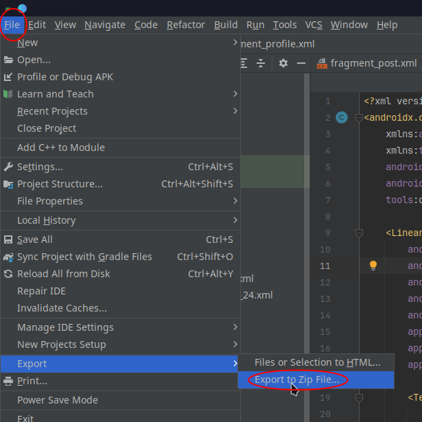
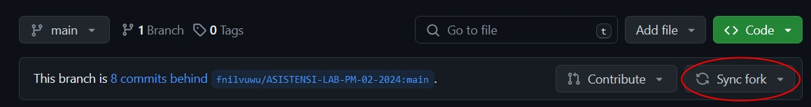

# ASISTENSI-LAB-PM-02-2024
Repositori untuk pengumpulan Tugas Praktikum Asistensi Group 02 Pemrograman Mobile 2024 Sistem Informasi Universitas Hasanuddin

## Aturan Pengumpulan
**Note:**  
_Untuk perintah yang dibungkus < > maka perintah tersebut diganti sesuai instruksi yang ada dalam tanda < > tersebut. Contohnya `mkdir <NIM>` menjadi `mkdir H071201021`_
- Silahkan fork repositori ini
- Lakukan clone terhadap hasil fork repository ini ke komputer kalian
  ```
  git clone <url-repositori-hasil-fork>
  ```
- Pindah ke repositori hasil clone dengan perintah berikut
  ```
  cd ASISTENSI-LAB-PM-02-2024
  ```
- Masuk ke folder NIM kalian
  
- Di dalam folder NIM kalian buat folder dengan nama "Pertemuan-<_no_pertemuan_>" tanpa tanda kutip. contoh: Pertemuan-1
- Di dalam folder pertemuan tersebut, kalian menambahkan file tugas praktikum yang telah kalian kerjakan dengan melakukan export .zip di android studio format nama file "assignment_<_no pertemuan_>.zip" tanpa tanda kutip
<p align="center" width="100%">
    
</p>

- Setelah semua file tugas telah diselesaikan dan telah diasistensikan lakukan perintah berikut
- **Jangan lupa sync direpository kalian sebelum melakukan push**

  ```
  git add .
  git commit -m "<pesan commit>"
  git push origin main
  ```
- NOTE : Pastikan menggunakan "Tokens (classic)" pada saat melakukan push (GitHub sudah tidak support menggunakan password, kecuali disetting untuk memperbolehkan password silahkan cari tahu sendiri)
  ```
  git push origin main
  username : your_username
  password : your_personal_access_token
  ```
- Setelah perintah tersebut berhasil, silahkan membuka repository hasil fork kalian di github dan lakukan pull request ke repository ini. 
- Apabila terdapat kesulitan, silahkan menghubungi asistennya.
